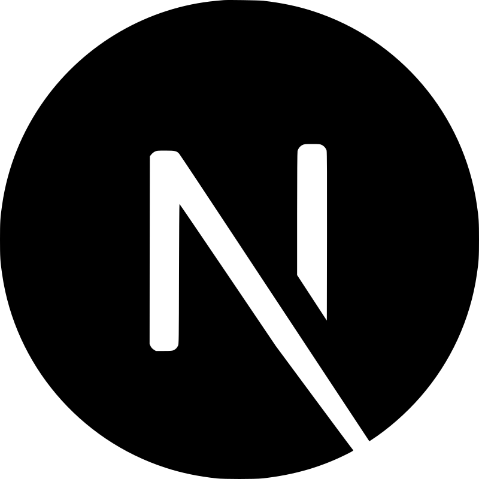

<!--
**prasad-kumar/prasad-kumar** is a ✨ _special_ ✨ repository because its `README.md` (this file) appears on your GitHub profile.

Here are some ideas to get you started:

- 🔭 I’m currently working on ...
- 🌱 I’m currently learning ...
- 👯 I’m looking to collaborate on ...
- 🤔 I’m looking for help with ...
- 💬 Ask me about ...
- 📫 How to reach me: ...
- 😄 Pronouns: ...
- ⚡ Fun fact: ...
-->

# Hi 👋 I'm Prasad Kumar

I'm a web developer with a passion for creating dynamic and responsive web applications. With a strong foundation in both front-end and back-end technologies, I specialize in building modern, user-friendly interfaces and robust, scalable applications.

##### 🚀 About Me
Current Focus: I’m currently focused on expanding my expertise in React and Next.js to build high-performance web applications and enhance my skills in the MERN stack for full-stack development.

##### 🌟 Projects
Here are some projects I’ve worked on that I’m particularly proud of:

###### TrustKart
  
I’m thrilled to announce the launch of TrustKart, our innovative e-commerce platform dedicated exclusively to fashion and clothing! 🌟  
Check it out : <a href="https://trustkart.onrender.com">TrustKart</a>
  

## Technologies which I use:

### Languages

  
  
  
  

 

### Frontend Technologies

  
  
  
  
  
  
  

 

### Backend Technologies

  
  
  
  
  
  

### Tools

  
  
  
  
   

##### 💡 I’m Currently Learning
Exploring advanced features in Next.js and optimizing performance for large-scale applications.
Enhancing my TypeScript skills to write more robust and maintainable code.

###  📫 Get in Touch
Email: kprasadkumar7@gmail.com  
LinkedIn: <a href="https://www.linkedin.com/in/prasad-kumar-a77650142/" target="_blank">Prasad Kumar</a>  
Instagram: <a href="https://www.instagram.com/its_me_prasad/" target="_blank">Prasad Kumar</a>  

Feel free to connect or reach out if you have any questions, collaboration ideas, or just want to chat about web development!

  
<!--  -->
  
 
